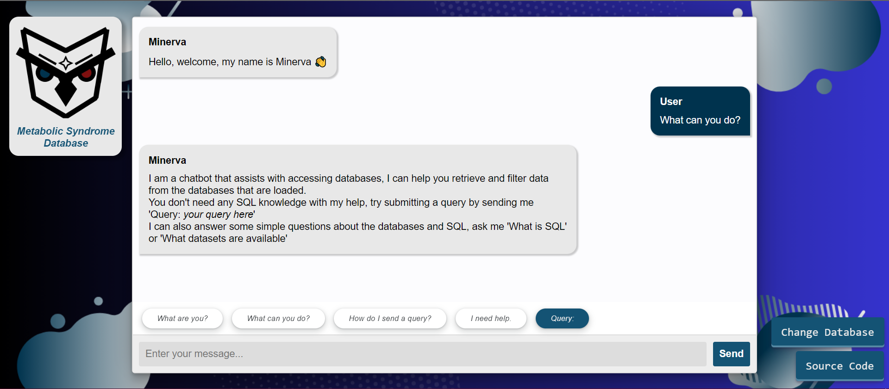
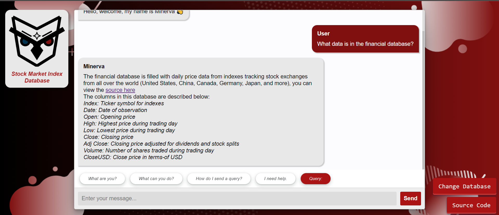

# DCU CA400 - Final Year Project

>Gareth Hogan 20379616  & Jack Farrell 20352136

---

## Table of contents

1. Setting Up Minerva 
2. Web Page
    - Layout of the Web Page
3. Using Minerva
    - Entering your Questions
    - Viewing the Output
    - Database Information
    - Changing Database

---

## Setting Up Minerva

please follow these instructions to get Minerva set up, it does requires a bit of work to get working, including getting the databases set up in MySQL yourself and your own access to the text-to-sql model:
> *These instructions were made and tested in a fresh Ubuntu environment, your system may already have some of these libraries installed*

1. First make sure you have Git installed (sudo apt install git)
2. Clone our repo
3. Navigate to /src in your terminal
   a. Make sure you have pip installed **sudo apt install python3-pip**
   b. Install the requirements for Minerva with **pip install -r requirements.txt**
4. Create your own *config.env* file in /src following the format seen below, this contains your database host IP address, database password, the user, the MySQL port and the auth token for the text-to-sql model.
   
5. Start the flask application by running the command "python3 app.py deploy"
6. This will power up Minerva and you can head to *127.0.0.1:5000* on your browser to open up Minerva's interface
---

## Web Page

Minerva's locally hosted web page consists of a text box where users can enter their questions alongside the chat history between Minerva and the user.

### Layout of the Web Page

This is the layout of the web page that a user will see once they begin using Minerva, Here you can see Minerva greeting the user and the chat history where the user has asked Minerva "What can you do?". as shown, Minerva's response to the user will be in the chat history box similarly to how text messages and other messaging apps.

Minerva answers the users question, explaining to the user what she is and what she can do. Along the bottom of the web page we can see the text box that the user is currently typing in. This area is visibly shown to be different due to the background colour being different from the history box above. Once the user has finished typing in their question they can click on the send button found on the right hand side. Common user questions can be found just above the text box that allows users to ask them without having to type it out.

On the left hand side there is a "Change Database" button found under the box that tells the user what database is currently loaded. This will then bring up a list of databases allowing the user to change what database Minerva gets the information from. Above is what the user will see when they click on the Change Database button.

When a user changes database the background changes to a different colour to easily and quickly tell the user that the database was changes succesfully. The top left corner also displays what the current database is if the user is unaware what colour is assigned to each database. In this screenshot it shows that Minerva can give you information about the database including what columns there are and what each column represents, this can assist the user in constructing their questions to get the information they want out of the database.

---

## Using Mineva
Minerva is very simple to use even if users have never had experience with chatbots before. Minerva has two functions that users can use to interact with her and they are using the text box to enter in and submit questions and viewing the output of the questions in the chat history bo above. Once Minerva has been set up corectly users will open up the web page and be greated with the layout as described above in the [Layout of the Web Page](#layout-of-the-web-page).

### Entering your Questions
Once there the user has arrived on the web page they will see the text box at the bottom, Users can click on the box and start typing in their question that they want Minerva to go and find. If a user wants to ask Minerva a question they can enter it in normally before hitting send, if the user wants Minerva to get information from the database they need to add "Query:" to the begining of their question. A query button is available allowing users to just click it instead of typing out "Query:" every time. Similar to how sending messages works users will see their question be placed into the above chat history section before Minerva goes about getting that information from the connected databases. If users are unsure on what questions would require a Query to be placed infront of it they can click on the "Example Prompts" button in the bottom right corner to view a pdf outlining some example questions.

### Viewing the Output
If the users question was succesful Minerva will output the information in the chat history before asking the user if they would like to enter another question. Once there are enough mesages that they all cannot fit on the page the chat history will get a scroll wheel allowing the users to go back and see what questions they asked and what answers they got. Using that a user may be able to learn and ask different questions until they are satisfied with the infomation they recevied.

### Database Information
Information about the databases can be found by clicking on the "Metabolic Database Info" or the "Financial Database Info" for respective information. The information provided from the buttons gives a high level overview of the each database such as basic information and where the information was gotten from. More detailed information about the databases such as column titles and what they represent can be gotten by asking Minerva "What is in the metabolic/financial database?".

### Changing Database
Changing the database the Minerva is currently connected to and will be pulling the information from is very simple. Users will see on the left side of their screen a "Change Database" button that they can click on, This will present them with a drop down menu clearly visable in the centre of their screen where they can then select the new database that they would like to connect to. Once the user has clicked on the new database they will be returned to the webpage that has the text box and chat history and can proceed with their queries for information from the new database.

---