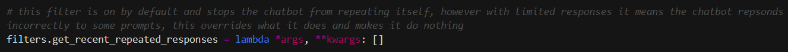
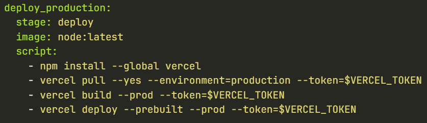
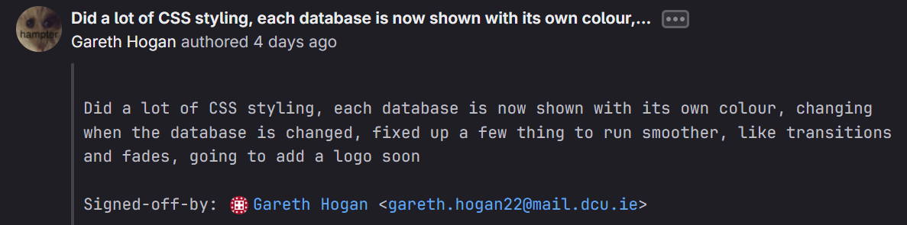
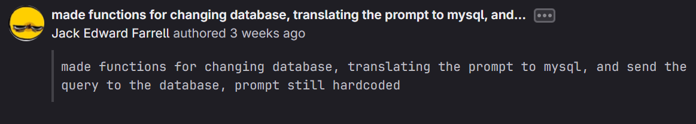
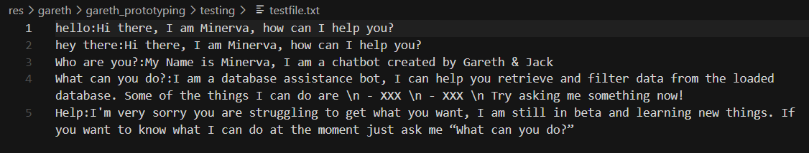
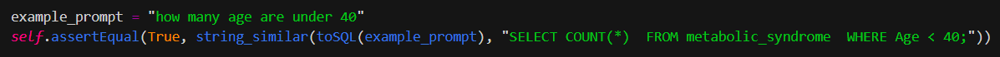
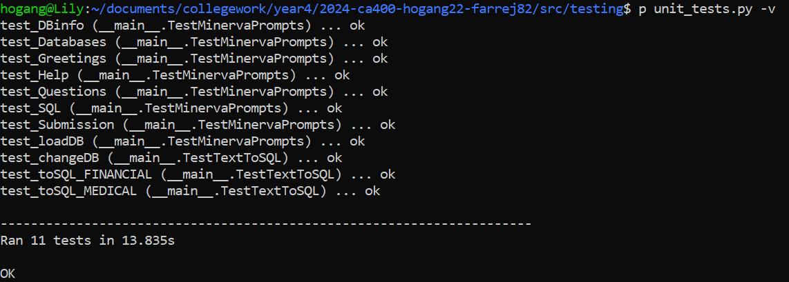

# DCU CA400 - Final Year Project

>Gareth Hogan 20379616  & Jack Farrell 20352136

---

## Table of contents

1. Introduction  
   1.1 Overview  
   1.2 Glossary
2. Motivation
3. Research  
   3.1. Chatbot Research - Gareth  
   3.2 Text-to-SQL Research - Jack  
      - Few-Shot-NL2SQL
      - IRNet
      - SQLNet
      - text2sql-API
4. Design  
5. Implementation  
6. Problems and Solutions  
7. Limitations  
   7.1 Chatterbot Downsides  
   7.2 Text-to-SQL API & MYSQL API Troubles  
   7.3 Hosting - A fruitless foray  
8. Testing  
9. Installation Guide  
10. What we have learnt  
11. Future Work

---

## Introduction

### Overview

The system we have designed is called Minerva, the purpose of Minerva is to assist unexperienced users with accessing and utilising databases in their workplace or everyday life. Minerva is an interactive chatbot solution, users can chat with her and ask questions about using the database whilst also submitting queries through the chat interface to the database. Minerva works using Chatbot and Natural Language technologies to interact and answer user questions, and can translate queries that the user has into SQL queries for the database, the data can then be returned and displayed to the users. Minerva is accessed through a simple, low tech webpage, she abstracts away a lot of the complexity of using databases and SQL queries and allows users to focus on asking for what they really need. The system can be loaded with multiple SQL databases that can be switched between anytime, Minerva is not tied to a specific database and could be used with many types of databases.

### Glossary

| Term | Description |
| --- | ----------- |
| Natural Language | Text written in language that humans naturally use |
| Natural Language Processing (NLP) | NLP is a branch of artificial intelligence that enables computers to comprehend, generate and work with human languages |
| Chatbot | A chatbot is a software app or web interface that is designed to mimic human conversation, it interacts with users in a conversational style|
| Application Programming Interface (API) | An API enables two software components to communicate with one another using requests and responses |
| Structured Query Language (SQL) | A  language used to build and search databases, it is also the language that Minerva translates natural language into. MYSQL is a version of SQL that we used |
|||

## Motivation

**How did we come up with the idea?**
We started brainstorming ideas for this project during the summer whilst on our INTRA placements, we wanted to get an early start on formulating an idea. We initially looked into what kinda of technology areas we both were interested in and how we could combine these into a project. Jack was interested in doing something along the lines of databases, data analysis or data mining, this would be chosen as the base of the project, we wanted to solve a problem that used data. Gareth was interested in the use of AI and Chatbot technology for user interaction, this provided a good partnership with the data analysis core of the project, we would present the system through a chatbot conversational interface, easy for users to interact with and interesting for us to work with and create. These two parts came together to form the seeds of Minerva, our database assistant, named after the roman goddess of wisdom.

**Our grand plan for Minerva**
Once we had the skeleton of a plan for what we wanted to create we had to flesh out what functionality we wanted to provide for users. We started by thinking of user scenarios that Minerva could be a proposed solution to. We quickly figured out that we wanted to use Minerva to help non-technical users access databases, our prime examples were users like nurses who might have access to large databases of patient and medical data, but they don't have the expertise or time to realise the full potential of analysing that data. Through the creation of Minerva we aspired to produce a solution that would allow users to quickly and easily query databases using natural language, display data, visualise it and analyse it.

**Supervisor Selection**
When finding a potential supervisor we looked into a few candidates and consulted two of them, Mark Roantree and Gareth Jones. We learned a bit about what topics each of them specialised on through our first semester modules, Mark would be a good supervisor to assist in the data analysis side of the project whereas Gareth's knowledge could help more with the chatbot and natural language aspects. After consulting both of them we decided to ask Gareth to supervise us as his vision and suggestions aligned better with what we wanted to achieve with Minerva.

> Note: To avoid confusion because Gareth Jones (supervisor) and Gareth Hogan (student) as they share the same first name, from this point onwards we refer to Gareth Jones as "our supervisor", any mention of Gareth should be referring to the student

---

## Research

In this section we will describe some of the research we conducted before starting the sections of this project we had never done before. We will also include some links to our sources.

The two main components of Minerva that needed to be researched for this project were the creation of the chatbot for interacting with users, which was done by Gareth, and the database access and Text-to-SQL, done by Jack.

### Chatbot Research - Gareth

Gareth conducted a lot of research into creating a chatbot and what the best approach to do this would be for our project. The chatbot being able to converse and talk to the user was a vital part of the project and without it the UI would never have worked as intended.

Luckily Gareth already had some experience with the creation of a user support chatbot from a previous internship and was familiar with some of the concepts involved in how a typical chatbot functioned.

So the first part of research was to look into they type of chatbot we wished to create, this was a vital decision to make as we wanted to set out our expectations for the level of intelligence that the end system would be able to demonstrate, to create a chatbot that has a high level of conversational skill would require a huge amount of effort and training data or using a prebuilt industry solution (for example ChatGPT), we did not want to take this route as we instead wanted to do much of the work ourselves even if it meant Minerva could not respond to everything, or she got stuck sometimes with difficult user prompts. We chose to design Minerva as a rule-based Chatbot, this means that she compares user prompts against different rules and selects the best one that matches the situation, this can continue to chain from rule to rule and produces output based on what the matched rules specify.

- [IBM Chatbot types](https://www.ibm.com/blog/chatbot-types/) - this IBM article was one we looked at a lot, it explains the different types of chatbots arranged in order from least intelligent/conversational to the highest intelligence and conversation skill
- [Yellow AI Chatbot types](https://yellow.ai/blog/types-of-chatbots/) - this was another article we loooked at, it also explains the different types of chatbots with a few extra examples and types that are hybrids

Once we had agreed upon the type of chatbot we wanted to try create we needed to look into how we could get this done, what tools and solutions are there out there to do this. We had already at this point decided that using Python was the best course of action, it is a powerful modern language that we are both very comfortable with, it is also known for being great to use when manipulating data and Natural Language. Gareth started to look into different tutorials and blog posts about how to create and train chatbots in python, some of which are linked below, the common denominator between a lot of these was the use of the chatterbot python library to create and run a chatbot in python, this library was what Gareth decided to use to create Minerva as it allowed us to actually create the chatbot using python code.

- [Hubspot - Craft your own chatbot](https://blog.hubspot.com/website/python-ai-chat-bot)
- [Realpython - Build a chatbot in Python](https://realpython.com/build-a-chatbot-python-chatterbot/)
- [Chatterbot Documentation](https://chatterbot.readthedocs.io/en/stable/index.html)

Aside from the Chatterbot library there actually was a surpising lack of tools or tutorials about creating chatbots using code, in any language. A lot of the examples and projects seen during research were small proof of concept or tutorial style bots with very simple designs. There was also a lot of enterprise solutions available to create a chatbot, things such as IBM Watson Assistant (which Gareth used during his assistant) could have been used, they provide a platform with which to build a chatbot solution, these are aimed as business clients and not student projects however, and they didn't allow us to actually code how Minerva would work so we inititally frowned upon these solutions and decided to use Chatterbot. We also were unsure of how these services would integrate with the other components of the Minerva system.

- [IBM Watson Assistant](https://www.ibm.com/products/watsonx-assistant)
- [Chatbot.com](https://www.chatbot.com/)

### Text-to-SQL Research - Jack

Jack was incharge of the back end of the project which included that database and the Text-to-SQL system which was the largest part of the backend. Having dealt with MYSQL databases in 2nd year and feeling confident with the notes provided by that a lot of the research that we focused on was for the Text-to-SQL system and how we go about implementing it into our project.

We ended up going through several different models each of which having their own unique problems that arose at different stages of development. The models that we tried were:

- [Few-Shot-NL2SQL](https://github.com/MohammadrezaPourreza/Few-shot-NL2SQL-with-prompting)
- [IRNet](https://github.com/microsoft/IRNet)
- [SQLNet](https://github.com/xiaojunxu/SQLNet)
- [text2sql-API](https://www.text2sql.ai/app)

**Few-Shot-NL2SQL**
This was the first model that Jack found after reaching out to professor Andy Way, who got us in contact with reasearchers who suggested we take a look at the [Spider Leaderboard](https://yale-lily.github.io/spider). The Spider Leaderboard is a leaderboard for the best Text-to-SQL models that are currently available, The leaderboard also provides links to the github where we can download and use the model. Jack went through the leaderboard and picked out this model as it did not require setting up a conda environment and looked the simplest to set up.

According to the README file the setup only required running the requirements.txt and then one python file, this was not the case as the model required we download the specific data from a google drive and also have a Chat-gpt API subscription. This model uses gpt-4.0 to help in the translating of natural language to MYSQL code. This API uses a "pay as you go" model so this is what initially caused us to move to a different model as we did not want to spend money on this project if we could help it, in addition, if we were to upload this to our gitlab someone else could then download it and use it multiple times causing the cost to increase rapidily and then we are left with a large bill.

After going through the other models before settling on our final choice we came back to this to try testing it out, Jack paid a small amount of money for us to test out the model before making a final decision. The model did work but was very limited to the questions that were alredy assigned to it as it appeared the data that it was using for translating the questions was hard coded into the model itself. This would mean that we would have to manually change all of the data in the model to be relevant to the database's that we want Minerva to pull information from and due to the large amount of time Jack spent researching all these different models, we decided to not pursue this model and instead go with the text2sql-API.

**SQLNet**
When we first moved on from the Few-Shot-NL2SQL model this was the next model that was found, similarly to the previous model it requied cloning the github repo but unlike the previous one it does not require an api to function. This would have allowed us to use this model completly offline and without encountering a pay wall. SQLNet uses Python and pytorch in order to operate but an issue was encountered very early on into testing with this model as it uses python 2 as opposed to python 3. We thought that this would only be a small problem but as Jack looked into the model more and tried to get it functioning we realised how much of a problem this actually was. 

The biggest problem caused by the older version of python is that [pytorch](https://pytorch.org/), an open source machine learning framework, has been updated since this model was made seven years ago and now only supports python 3. Without pytorch the model will not work as there will be no framework for the model to build off of. The 2 solutions to this problem is to either update the code to python 3 or to download an older version of pytorch that could possibly run with python 2.

What Jack did first was try to update the python 2 code into python 3 but due to the large amount of files and the complexity of the model doing it manually would take far too much time so we tried using the python package [2to3](http://python3porting.com/2to3.html) to assist in updating the files. Initially this appeared to work and progress on implementing the model was going well but upon closer inspection the 2to3 package seemed to not be fully converting the code into python 3 instead it was changing the majority but there were edge cases that remained unchanged. This lead to errors occuring and the error log was saying that the error occuring in the imported libraries. Without knowing the source of the error and still having to go through all the files manually to try and find the source of the errors which is what we were trying to avoid in the first place we decided to try out our other possible solution as no progress was being made here.

After updating the code didn't work Jack moved on to trying to download an older version of pytorch allowing it to interact with the python 2 code as it would have when it was first released. The github page does not say which version of pytorch they used which required us to go through multiple versions and extra research trying to find what version of pytorch supports python 2. Not much progress was made in this solution as we quickly came to the relisation that having our project split between a python 2 backend and a python 3 frontend could cause us problems later on when we try to combine our sections to create the full project. Becuase of this and no solution working due to the age of the model and its necessary components updating we went back to the drawing board and started looking for offline Text-to-SQL models that are more recently made.

**IRNet**
IRNet was the last model we found and at this time we were very worried about the amount of time we had spent on research and how much time we have left as if we spent too long on research we would have very little time left for the actual implementation of the model and fixing any bugs that would show up as we try to get the model working for our project. Because of this awareness and a potential solution with the API, this was the model we spent the least amount of time on. We ran into a very unique problem with this model where when following the instructions and running the train.sh file an error would occur stating "train.sh: 9: python: not found". Unsure what this means looked at the code and tried updating it to python 3 as maybe there was an issue since python 3 was installed but not the generic python, but when we tried to save our changes the changes would not be reflected when we ran the code instead we got the same error. When we went to open back up the file in Visual Studio Code the changes we made were still there, meaning the our changes were saved but not being reflected in the file itself, we had changed all the previous models the same way so it couldnt have been how we were saving it. We then did the cat command on train.sh to see and again the changes we made were present in the file. We tried many different ideas to try and get the file to accept our changes but no progess was made. Unsure what the problem was, how to fix it and dwindling time to get the model functioning we decided to leave this model with what we had done and move on.

**text2sql-API**
After spending a large amount of time trying and testing a variety of different models and without anything to show for it we decided to choose the API approach as, while it was simpler then getting the models set up, it wasn't us being handed a solution we still had to put in a lot of effort and create our own functions in order to get the results we wanted.

The first thing that we needed to do was set up the API in python. Having to learn how to implement API's in python was something we had never done before but due to our knowledge of API's in javascript it was simple to get the basics. We used this [API Tutorial](https://www.dataquest.io/blog/python-api-tutorial/) to help us with the exact syntax needed to get the API functioning.

The API needed different data in the "headers" and "data" sections. The header only had one piece of information and it was the Authorization key needed to give us access to the API while data included the "prompt" that we want to be translated, "type" indicated what language it is translating to, the type is hardcoded as it will always be translating into MYSQL. The last information included in data is the schema, The schema is used to let the model know what the column names are and what type of data is stored in them which helps in the creation of the MYSQL code.

More information about how we developed this code and any problems we encountered will be discussed in [Text-to-SQL API & MYSQL API Troubles](#text-to-sql-api--mysql-api-troubles)

---

## Design

**What are we building?**  
This section will go over the high-level design behind Minerva, how we planned it out into different components and what each is responsible for. We will walk you through some diagrams we have for the system design.

### System Architecture

Above is our System Architecture Diagram this shows a high-level overview of what Minerva is designed to do, how each is function is seperated into different components and what each one contains in order for the function to work. It also contains implementation details such as links and technologies present used in each component. Implementation will be covered in greater detail in the Implementation section.

In this section we will give an overview on how we designed Minerva and her individual components. We designed Minerva with two main components in mind, they are:

- Chatbot Frontend
- Translation and Database Backend

The role of the frontend chatbot component is to render the web page and is the only point of access for the user to interact with Minerva. Through the frontend the user will be able to ask Minerva questions about the database, be given the infomation they are asking, and also be able change the database to be able to retrieve different information. It is throught he frontend that users gain access to the information stored in the backend. The questions users input into Minerva are sent to the backend where they will be translated and then queried to the database before the information is returned to the user on the front end.

The backend is where the Text-to-SQL translation and the database api are located. Users utilise the back end through the front end when they ask Minerva a question or change the database using the buttons found on the web page. The main responsibilities are to process user input and send the processed question to the database, then returning the retrieved information to the frontend.

### Frontend Architecture

The frontend is responsible for everything the user sees and interacts with, its primary function is to be a user interface for the user and it is what allows the user to interact with Minerva. The main part of the frontend web page is the chat history and text box. These two sections take up the majority of the page with the rest being taken up by a Minerva logo, A box indicating what database is currently connected, a change database button, and quick access buttons allowing the user to auto fill common questions.
The frontend is responsible for:

- Present the webpage to the user
- Allowing users to enter questions to Minerva
- Telling Minerva what database they want information from
- Sending the user input to the backend
- Returning the database information to users

Below you can view a use case model we made for the frontend, which shows you how a user interacts with the frontend.

From the above diagram you can see that user interaction with Minerva is very limited but the variety of questions that a user can ask is inumberable and Minerva will be able to cope and return the information to the user if the data is in the database. Most of the functions in the frontend interact with the backend as the frontend does not process inputted data but just displays it.

### Backend Architecture

The backend is responsible for handling all the data that the user will be accessing through Minerva by the use of API's for both the Text-to-SQL model and accessing the databases. Some of the data handled by the backend will not be visable to the user at all times. The responsiblitites of the backend are:

- Translating the input into MYSQL code
- Sending the generated SQL code to the database
- Returning the database infomation to the frontend

The sequence diagram above showcases the order of operations that occur when a user inputs their question on the frontend.

**Description of the flow:**
- Backend receives user input from the frontend
- User input is then sent to the Text-to-SQL model via an API
- Backend receives the translated user input 
- Sends the user query to the database
- Database returns the information that the query outlined
- Backend sends the database information to the frontend for it to be displayed

---

## Implementation

**How did we build it?** 
The design section above describes what our system should be able to do, and a high-level view of how it would do things. This section describes how we implemented Minerva. We will go through the libraries and languages we used and give some code samples throughout.

### Frontend Implementation

The frontend is responsible for the user interface and rendering of the webpage alongside being how users interact with Minerva. This is done useing a Flask framework 

### Backend Implementation

The backend is responsible for handling the data that it receives from the user and the frontend. The types of data that the backend would be receiving would be user query's, and database changes with the queries being the most common data the backend will receive. 

The backend is constructed of multiple functions which allowed gareth to easily connect the backend to the frontend and allowed the easier transfer of queries into the backend via function arguments.

**How is the query translated to SQL?**
Once the users question has been received the first thing that is done is that the backend translates the users query into SQL so the database will be able to understand and return the necessary information. We used the requests library to make the set up of the API easier in python as the only experience we had using API's was in javascript. The translation is done by sending the users query through an API to the Text-to-SQL model that we used and explained in detail in earlier in this document. The API requires specific data to be inputted which is the Authorization token which is resonsible for allowing the use of the Text-to-sql Model as without it we would not be allowed to use the mode. The API also requires the prompt, type, and database schema so it can make the SQL as accurate as possible and work when we send it to the database. The model returns the translated query alongside other syntax which is then needed to be remove so it is just the SQL query, this is done through the strip() and split() functions as the additional syntax will cause errors to occur at other parts of the backend.

**Sending the query to the database**

Once the translated query has been returned we then send the query to the database that the user has selected via the mysql library. The mysql library  is what is needed to use the mysql API as stated on the mysql website. Similarly to the Text-to-sql API we need 

---

## Problems and Solutions

<!-- *Problems we could solve, small bits* -->
In this section we will highlight some of the problems we encountered over the course of Minerva's development, unique problems that we needed to solve and how we went about doing it.

---

## Limitations

<!-- *Limitations be imposed on us by bad libary, bad model, etc.* -->
In this section we talk about some of the blockers we encountered during development of Minerva, these were things that caused significant delays, redesigns or things we generally couldn't fix or avoid. We will outline the problems we had and how they impacted on the final version of Minerva, and what we might have done to fix them.

### Chatterbot Downsides

<!-- Talk about how shit CHatterbot is -->
One major component of this project that limited us was the Chatterbot library that was used to develop Minerva. As we said in the research section, this library seemed to be in very common use for making basic chatbots in python, and there were lots of recommendations online to use it for making a chatbot in python.

Chatterbot was a good starting point for Minerva, it allowed us more control over the development as we were using code instead of a prebuilt tool or website. However Gareth started to progress past the basic features of Minerva he started to realise how limited Chatterbot is in its features, and how badly documented the available features were.

**Filters**
A specific example of where things started to turn south was when Minerva started exhibiting strange behaviour, she would respond incorrectly or misunderstand the most basic of prompts such as "Hello" for unknown reasons and there wasn't a pattern to it. After much research, testing and looking through the logs the problem was discovered, by default Chatterbot has a filter that stops a chatbot repeating itself too much, it downweights or excludes answers that it has recently responded with, the problem with this is that it persists across conversations and instances, meaning common prompts such as "Hello", "Hi There" and other greetings were being misunderstood because Minerva was responding to them all the same. What was even more frustrating was that nowhere in the documentation was there a mention of this filter being on by default, and there was no documented way to turn it off, here you can view the entire page they have on filters [Filter Documentation](https://chatterbot.readthedocs.io/en/stable/filters.html). Ultimately we bypassed this by setting the filter function to do nothing in our app but it is still enabled.

The filter example was just one of many problems we encountered as we tried to make Minerva more advanced in her conversation skills, we quickly realised that Chatterbot offered very little in the name of advanced features or support for making chatbots that were more advanced than just recognising an input and returning the trained response. We were missing tools to be able to slice the prompt up and send it to our backend, recognise prompts that were similar but not exactly the same as our training data, or even to do more than just return a string, we had to implement our own way to call a function when a specific prompt was encountered.

In the end, we were too far into development to really rip out Chatterbot and replace it, we also could not find any suitable replacements, we would either have to downgrade to natural language processing tools and implement a lot of the chat processing ourselves, or we could sacrifice using code and control and use a web solution such as IBM watson assistant. Neither of these solutions really appealed to us or seemed better than what we decided to do, which was to keep the Chatterbot library to run the basics and to work around it to implement the more advanced features ourselves, what this means is that Minerva is slightly less intelligent that we originally wanted, she needs more help and prompt formatting by users to be able to understand what they want.

### Text-to-SQL API & MYSQL API Troubles

<!-- Talk about the different trials and tribulations of all the models and APIs u tried -->

> Note: The troubles that caused us to switch models were stated above in the research section, Here we will be discussing troubleshooting the API, Functions, and Databases.

Jack first made the file using the API's without having them be functions as he was ensuring the API's themselves were functioning before turning them into functions. The first API that was made was the Text-to-SQL API, this was done using the by importing the "requests" library and using requests.get() this gets us the translated query and by using a some string management code to clean up the output we can now focus on creating the MYSQL API and pass the output to the database.

For the MYSQL API we used mysql.connector library [mysql.connector library](https://dev.mysql.com/doc/connectors/en/connector-python-introduction.html) which allowed us to both send and receive data from the database. This allows us to send queries and get the information the user was looking for back out. We also found error handling code that we implemented that made sure if there was an error in the name of the database you were trying to access or the username or password used, then it would return those errors. This was implemented more for our sake during development as during the demonstration we will already have everything set up correctly and so this code will not be used but we decided to keep it in as it shows we have error handling.

As we were creating our own file to get the API to function how we wanted it to, We decided to have both the Text-to-SQL and MYSQL API's in the same file as having minerva import one file with many functions is better than having minerva run seperate python scripts for each API and database available. Jack made the functions and got them working ecept for the swapDB function as he was struggling with the global variables. While he was working on other parts of the project Gareth set up fixed the function and also set up a config file that allows for the username, passwords, device IPv4 addresses, etc to be kept private and not have those pieces of information available on the gitlab for anyone to access. The way he did this was by using the [dotenv libary](https://pypi.org/project/python-dotenv/).

### Hosting - A fruitless foray

<!-- little section on trying to host not on localhost, not worth effort to try find free version -->

One thing we tried out briefly was looking to host our flask application somewhere other than locally, this would be a learning experience as neither of us had done this before and would also provide a cleaner way to view Minerva as the webpage would be accessible from any device all the time, instead of having to be run locally and accessed that way aswell.

Gareth trialed using three different services to host Minerva, each is outlined below

**Heroku** - [Website](heroku.com)
We didn't get very far with using Heroku, it seemed promising and there was several tutorials and examples available online of using it to host a flask application. However after installing the CLI tool and trying to upload a test application and then Minerva it became very unclear as to what was going wrong, to use Heroku you must create a *Procfile* in your application, this tells Heroku how to run the app, however no matter what way we formatted this file we could never get the app up and running on Heroku, so we quickly moved to trying a different service.

**Vercel** - [Website](vercel.com)
Vercel was a very promising candidate and we achieved the most progress using it. Vercel was intitially reccomended by a fellow classmate who was using it for their own project so we knew it had potential to work for ours, however differences in our project types meant we encountered a few problems. The first problem was integrating our git repo into Vercel, vercel is very easy to use and connect with default git providers like Github and Gitlab, however because the School of Computing hosts its own Gitlab instance it was not as simple as signing in and picking a repo to host, instead we had to link our repo using an access token and then trigger a deployment everytime a push was made to our repo using deploy script in our CI/CD pipeline (seen below)

Our next problem encountered was that Vercel did not natively support Flask as a template, it supports many templates such as Next.js, Nuxt.js and SvelteKit, these templates make it much easier to use and deploy. There are ways to work around this though, and there are many examples online of how people get flask apps hosted on Vercel, we tried following a lot of these but nothing seemed to work, there was a lack of clear error or debugging messages so each time we deployed we didn't really know what was wrong we just had to try different things each time. The best we got was our site was deployed however the CSS and JS did not deploy so it was bare HTML with no functionality attached. After much trial and error we decided to move on.

**Python Anywhere** - [Website](pythonanywhere.com)
Python Anywhere was the last service we tried, and it seemed very promising, it was centered all around python and so Flask was very often used and deployed with Python Anywhere, it was not as flashy or modern as the other two systems but all we needed was it to work. However we quickly ran into an unavoidable problem, we ran out of storage on the free plan, because the Chatterbot library is quite large and has many dependencies we were unable to install it before we ran out of storage. This quickly ruled out this as an option as we did not want to pay for a service.

**Conclusion**
After much frustration and many experiments we decided to just stay on localhost and not waste anymore effort on hosting, it provided very little value to the final project and wasn't required. This version of Minerva is just a proof of concept, so localhost is perfectly adequate for what we are showing. Hosting and deploying Minerva is a natural extension of this project and could easily be done with more time and money if needed, but for the scope of this project we kept Minerva hosted locally.

---

## Testing

This section contains an overview of the testing practices we implemented for Minerva throughout the development. You can also read about our user testing at the end of this section and how we used the feedback to improve the final version of Minerva.

### Git

Throughout our project as required we used Gitlab to store our code. This was vital for working well together on the same set of files especially near the end of the project where we both we doing work on the same files every day. Every time we would finish our work for the day or complete a feature we would commit and push the changes to our repo and notify our partner.
This flow of work helped make sure we had no major merge conflicts during this project and could work unimpeded, we also made sure to be in constant communication with each other about what we were doing and planning to do so that neither of us were implementing the same feature or writing the same section of a document.
Below you can see two examples of the commits we made to the repo, when committing we tried to be as thorough in our commit message as we could, so that our partner could quickly identify what was done and in future we could easily search our logs for specific changes.

### CI/CD Pipelines

For most of the project we made use of gitlab pipelines to automate some of the testing of Minerva, these tests were used to confirm that Minerva was performing as expected and were run every time an update was pushed to our repo.
These test were very useful during the prototyping stages of Minerva so that every time a change was made we could verify that Minerva was still responding correctly to the basic prompts we had made before. The tests were made to verify Minerva's answers to some example prompts, one of our early test files can be seen below, it is still located in the prototyping directory of res/gareth/gareth_prototyping/testing.

In the image above you can see the file is made of pairs of strings, where on the left is the prompt Minerva would receive and on the right is our expected output. Each time an update was pushed to our repo the pipeline would setup an environment with Chatterbot installed and run a shell script to check Minerva's responses to the prompts given and verify the answers.

However as we approached the end of the project and we began linking things together it became evident that the automated pipeline was proving too much hassle to keep updating and fixing because of the complex relations of some of the dependencies in the docker environment it made on gitlab. To load the Chatterbot library we used an old docker image as we could not get chatterbot to install manually without this image, this presented problems however once MySQL was linked into the project as the code required a newer version of python than what was present in the Chatterbot image. We decided after more than thirty attempts to fix the pipeline that we would change our focus to less automated tests but have more manual tests in the form of unit tests and system tests that we could run ourselves. These new tests are outlined in the sections below.

The pipeline file (.gitlab-ci.yml) is still present and can be viewed however the running of the prompt tests has been disabled.

### Unit Testing

The nature of Minerva is a user centric system, a lot of how the system works requires user input and interaction through the web interface, because of this we knew that we wouldn't be able to fully automate testing and instead wanted to focus efforts on producing a good unit testing system that we could expand and run as the systems evolved to maintain good coverage of all Minerva's features and verify they worked everytime we made changes or major updates.

Our unit tests can be viewed in /src/testing/unit_tests.py

We designed user tests with the default unittest python library.
The tests are separated into two major sections, the first contained in the "TestTextToSQL" class deals with making sure that the API code that Jack created is functioning correctly and translating natural language to SQL as expected. This class has three main tests, one to check that the database loading and changing is done correctly, then we have a set of example prompts for the medical database, and some for the financial database, each set is executed and checked against expected output, an example is seen below.

The second class is "TestMinervaPrompts", this class contains the test dealing with Minerva, inputting example prompts and checking that Minerva is responding correctly by checking against expected output. An example of a testcase can be seen below.

These unit tests can be run by just entering the src/testing directory and running "python3 unit_tests.py -v". We try to run these tests as often as we make changes to the system code, and we also tried to make sure we expanded these tests and example prompts as Minerva grew and gained more training data. The unit tests are also executed by querying our flask application that hosts Minerva, which must be running to execute the tests, this means that they mimic a request from the UI as closely as possible and provide a good verification of Minerva's status.
If all is working well an output like below should be seen.

### System Testing

The unit tests and automated testing we implemented help a lot with verifying the integrity of Minerva and noticing quickly any bugs or inconsistencies introduced after major changes. However to fully and rigourously test Minerva we need to do a lot of manual Ad-Hoc testing and system tests, interacting with Minerva through the web interface.
A lot of the system is regularly tested and put through its paces due to the nature of development and how we do a lot of Ad-Hoc testing as we go along and add new features, testing new prompts, new buttons, new javascript functions.
However as we approached the end of the project we wanted to implement more standardised and repeatable system walkthroughs/tests, these would include multiple prompts and interactions from loading Minerva to getting a final results, that way we can step through the system as a user would want to checking along the way for any bugs or errors.
An example of a system test we have outline is seen below.

These walkthroughs are varied and allow us to make sure we have checked each and every part of Minerva by executing each one. This is important to find and solve bugs in areas of Minerva that we implemented a long time ago or do not use as much. These also help us prepare for demonstrating Minerva at the end of our project.

### User Testing
<!-- Methods we had to use -->
<!-- User centric so not a lot of automatic testing -->
<!-- Ethics, results and analysis -->
<!-- Outcomes -->

---

## What we learnt

<!-- SKills, tech and teamwork stuff, planning etc -->
We learnt a lot over the course of this project, of course we learnt a lot in our specific sections Gareth with Chatbots and hosting, Jack with Text-to-SQL models and API's. Thats not only what each of us learnt we also learnt about each others sections when it came to combining are parts and testing Minerva.

When we started this project both Jack and Gareth had very similar experience with databases and API's alongside gareth having worked with chatbots before. Now after completing the project both of us have gained valuable insights into the operations and development of chatbots and API's. What Jack learnt most was database and API interaction and gained a deeper insight into how databases work and how they can be manipulated. <!-- Gareth learned what gareth learned *plz write what you learned :)*. 

Teamwork, planning and communication where all skills that we developed as part of this project, having worked with each other before we knew what to expect from the other person but having this project have such influence over our final grade we pushed ourselves to improve every aspect on how we work together. We did this not only so the project would run more smoothly but also to improve our skills for when we start our jobs as we would have to develop these skills anyway and getting a head start doesn't hurt.

This project was a great opportunity for us, not only did we get to expand our knowledge but we also got a small taste of what it will be like after college and when we are working in teams to create products for businesses. It has allowed us to practice all of the necessary skills and see the value in each of them without the pressure or risk of making a mistake that has a financial cost to it. These skills will be invaluable in the coming years and will stand to us during our career.

---

## Installation Guide

If you would like to try out the system for yourself please follow these instructions:
> *These instructions were made and tested in a fresh Ubuntu environment, your system may already have some of these libraries installed*

1. First make sure you have Git installed (sudo apt install git)
2. Clone our repo
3. Navigate to /src in your terminal
   a. Make sure you have pip installed **sudo apt install ptyhon3-pip**
   b. Install the requirements for Minerva with **pip install -r requirements.txt**
4. Start the flask application by running the command "python3 app.py deploy"
5. This will power up Minerva and you can head to *127.0.0.1:5000* on your browser to open up Minerva's interface 

## Future Work

<!-- What we would like to have worked on more, natural extensions that could be accomplished next, what could be added or polished -->

<!-- she does this just want to double check with gareth before deleting anything

if we were to continue development on Minerva and add additional functionality one of the first things that we would add would be an option for Minerva to show the user the translated SQL code. Currently Minerva takes the users question and returns to them the information from the database that answers the questiom, what this feature would do would be instead of returning the answer to the question Minerva would return the users question in SQL format. This would expand Minervas capabilities and would allow her to be used as a SQL learning assistant aswell as a tool used for getting information, allowing her to be useful in a wider variety of markets.-->

Close to the end of the project Jack toyed with the idea of having Minerva be able to access a database on a seperate machine, making it more realistic to how Minerva would be operating in a business setting. Due to the deadline approaching and the documentation still needing to be done we thought it would be best to focus on the documentation rather than add in a feature that we would have to spend large amounts of time researching and testing. Implementing this feature could also cause Minerva to no longer work meaning that if we didnt get it working by the deadline we would have to spend more time everting all the changes.

When we started this project we had planned for Minerva to have the ability to visualise the data and output a variety of charts based on the data the user requested. Over the course of the project we focused on getting the core function up and running which was the ability for Minerva to translate natural language and return database information. This took up a lot of time combined with the research and testing it left us with very little time to reseach, lean, implement, and test the code necessary to get data visualisation working. Out of all of additional functionality we would like to implement this would be the one that we would most like to get functioning.

### Training and Intelligence

### Expanding Functionality

### Deployment
