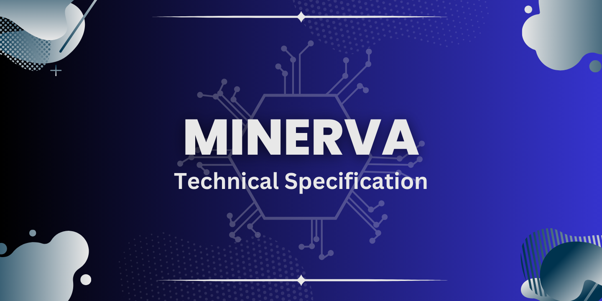
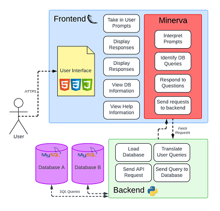
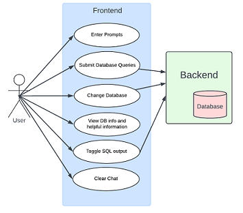
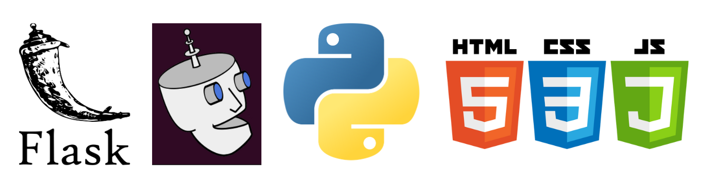
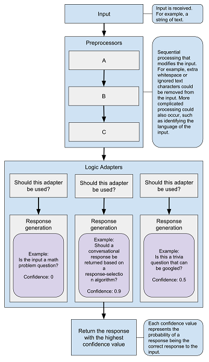
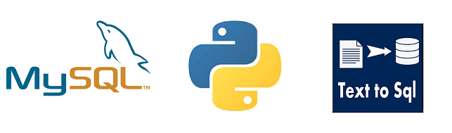
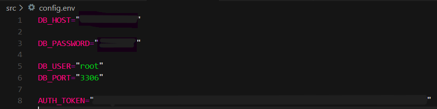

# DCU CA400 - Final Year Project

>Gareth Hogan 20379616  & Jack Farrell 20352136

---

## Abstract

Minerva is a system developed to try to help bridge the gap between SQL database access and non-technical users through the use of natural language processing and translation technologies presented through a web chatbot interface. We hoped to provide a view into a solution to help access the value that big data has for those who do not have the means to access it.
This technical specification outlines the development of Minerva from the research and design of the system to the final implementation and testing of Minerva, showing what we initially planned to achieve and what emerged in our final system.

---

## Table of contents

1. Introduction  
   1.1 Overview  
   1.2 Glossary
2. Motivation
3. Research  
   3.1 Chatbot Research - Gareth  
   3.2 Text-to-SQL Research - Jack  
4. Design  
   4.1 System Architecture
   4.2 Frontend Architecture
   4.3 Backend Architecture
5. Implementation
   5.1 Frontend Implementation
   5.2 Backend Implementation  
6. Problems and Solutions  
   6.1 Chatterbot Downsides
   6.2 Text-to-SQL API & MYSQL API Troubles
   6.3 Hosting
7. Testing  
   7.1 Git
   7.2 Unit Testing
   7.3 System Testing
   7.4 User Testing
8. What we have learnt  
9. Installation Guide  
10. Future Work
   10.1 Training & Intelligence
   10.2 Graphing & Data Analysis
   10.3 Distributed Database & Deployment

---

## 1. Introduction

### 1.1 Overview

The system we have designed is called Minerva, the purpose of Minerva is to assist inexperienced users with accessing and utilising databases in their workplace or everyday life. Minerva is an interactive chatbot solution, users can chat with her and ask questions about using the database whilst also submitting queries through the chat interface to the database. Minerva works using Chatbot and Natural Language technologies to interact and answer user questions and can translate queries that the user has into SQL queries for the database, the data can then be returned and displayed to the users. Minerva is accessed through a simple, low-tech webpage, she abstracts away a lot of the complexity of using databases and SQL queries and allows users to focus on asking for what they really need. The system can be loaded with multiple SQL databases that can be switched anytime, Minerva is not tied to a specific database and can be used with many types of databases.

### 1.2 Glossary

| Term | Description |
| --- | ----------- |
| Natural Language | Text written in language that humans naturally use |
| Natural Language Processing (NLP) | NLP is a branch of artificial intelligence that enables computers to comprehend, generate and work with human languages |
| Chatbot | A chatbot is a software app or web interface that is designed to mimic human conversation, it interacts with users in a conversational style|
| Application Programming Interface (API) | An API enables two software components to communicate with one another using requests and responses |
| Structured Query Language (SQL) | A  language used to build and search databases, it is also the language that Minerva translates natural language into. MYSQL is a version of SQL that we used |
| Text-to-SQL | A process of transforming natural language sentences into equivalent SQL queries for a database |
| Conversational Interface | A way of interacting with a system via talking to it, through a text like interface or sometimes speech |
| (User) Prompt | Piece of input that a user sends into the system |
| Database Schema | A blueprint that shows the different tables, columns and types of data in the database |

## 2. Motivation

**How did we come up with the idea?**
We started brainstorming ideas for this project during the summer whilst on our INTRA placements, we wanted to get an early start on formulating an idea. We initially looked into what kind of technology areas we both were interested in and how we could combine these into a project. Jack was interested in doing something along the lines of databases, data analysis or data mining, this would be chosen as the base of the project, we wanted to solve a problem that used data. Gareth was interested in the use of AI and Chatbot technology for user interaction, this provided a good partnership with the data analysis core of the project, we would present the system through a chatbot conversational interface, easy for users to interact with and interesting for us to work with and create. These two parts came together to form the seeds of Minerva, our database assistant, named after the Roman goddess of wisdom.

**Our grand plan for Minerva**
Once we had the skeleton of a plan for what we wanted to create we had to flesh out what functionality we wanted to provide for users. We started by brainstorming user scenarios that Minerva could be a solution to. We quickly figured out that we wanted to use Minerva to help non-technical users access databases, our prime examples were users like nurses who might have access to large databases of patient and medical data, but don't have the expertise or time to realise the full potential of analysing that data. Through the creation of Minerva, we aspired to produce a solution that would allow users to quickly and easily query databases using natural language, display data, visualise it and analyse it.

**Supervisor Selection**
When finding a potential supervisor we looked into a few candidates and consulted two of them, Mark Roantree and Gareth Jones. We learned a bit about what topics each of them specialised in through our first semester modules, Mark would be a good supervisor to assist in the data analysis side of the project whereas Gareth's knowledge could help more with the chatbot and natural language aspects. After consulting both of them we decided to ask Gareth to supervise us as his vision and suggestions aligned better with what we wanted to achieve with Minerva.

> Note: To avoid confusion because Gareth Jones (supervisor) and Gareth Hogan (student) share the same first name, from this point onwards we refer to Gareth Jones as "our supervisor", any mention of Gareth should be referring to the student

---

## 3. Research

In this section we will describe some of the research we conducted before starting the sections of this project we had never done before. We will also include some links to our sources.

The two main components of Minerva that needed to be researched for this project were the creation of the chatbot for interacting with users, which was done by Gareth, and the database access and Text-to-SQL, done by Jack.

### 3.1 Chatbot Research - Gareth

Gareth conducted a lot of research into creating a chatbot and what the best approach to do this would be for our project. The chatbot being able to converse and talk to the user was a vital part of the project and without it, the UI would never have worked as intended.

Luckily Gareth already had some experience with the creation of a user support chatbot from a previous internship and was familiar with some of the concepts involved in how a typical chatbot functioned.

So the first part of research was to look into the type of chatbot we wished to create, this was a vital decision to make as we wanted to set out our expectations for the level of intelligence that the end system would be able to demonstrate, to create a chatbot that has a high level of conversational skill would require a huge amount of effort and training data or using a prebuilt industry solution (for example ChatGPT), we did not want to take this route as we instead wanted to do much of the work ourselves even if it meant Minerva could not respond to everything, or she got stuck sometimes with difficult user prompts. We chose to design Minerva as a rule-based Chatbot, this means that she compares user prompts against different rules and selects the best one that matches the situation, this can continue to chain from rule to rule and produce output based on what the matched rules specify.

- [IBM Chatbot types](https://www.ibm.com/blog/chatbot-types/) - this IBM article was one we looked at a lot, it explains the different types of chatbots arranged in order from least intelligent/conversational to the highest intelligence and conversation skill
- [Yellow AI Chatbot types](https://yellow.ai/blog/types-of-chatbots/) - this was another article we looked at, it also explains the different types of chatbots with a few extra examples and types that are hybrids

Once we had agreed upon the type of chatbot we wanted to try to create we needed to look into how we could get this done, and what tools and solutions are there out there to do this. We had already at this point decided that using Python was the best course of action, it is a powerful modern language that we are both very comfortable with, and it is also known for being great to use when manipulating data and Natural Language. Gareth started to look into different tutorials and blog posts about how to create and train chatbots in Python, some of which are linked below, the common denominator between a lot of these was the use of the chatterbot python library to create and run a chatbot in python, this library was what Gareth decided to use to create Minerva as it allowed us to create the chatbot using python code.

- [Hubspot - Craft your own chatbot](https://blog.hubspot.com/website/python-ai-chat-bot)
- [Realpython - Build a chatbot in Python](https://realpython.com/build-a-chatbot-python-chatterbot/)
- [Chatterbot Documentation](https://chatterbot.readthedocs.io/en/stable/index.html)

Aside from the Chatterbot library there actually was a surprising lack of tools or tutorials about creating chatbots using code, in any language. A lot of the examples and projects seen during the research were small proof of concept or tutorial-style bots with very simple designs. There were also a lot of enterprise solutions available to create a chatbot, things such as IBM Watson Assistant (which Gareth used during his internship) could have been used, they provide a platform with which to build a chatbot solution, these are aimed as business clients and not student projects however, and they didn't allow us to actually code how Minerva would work so we initially frowned upon these solutions and decided to use Chatterbot. We also were unsure of how these services would integrate with the other components of the Minerva system.

- [IBM Watson Assistant](https://www.ibm.com/products/watsonx-assistant)
- [Chatbot.com](https://www.chatbot.com/)

### 3.2 Text-to-SQL Research - Jack

Jack was in charge of the back end of the project which included that database and the Text-to-SQL system which was the largest part of the backend. Having dealt with MYSQL databases in second year and feeling confident with the notes provided that a lot of the research that we focused on was for the Text-to-SQL system and how we go about implementing it into our project.

We ended up going through several different models each of which had their own unique problems that arose at different stages of development. The models that we tried were:

- [Few-Shot-NL2SQL](https://github.com/MohammadrezaPourreza/Few-shot-NL2SQL-with-prompting)
- [IRNet](https://github.com/microsoft/IRNet)
- [SQLNet](https://github.com/xiaojunxu/SQLNet)
- [text2sql-API](https://www.text2sql.ai/app)

**Few-Shot-NL2SQL**
This was the first model that Jack found after reaching out to Professor Andy Way, who got us in contact with researchers who suggested we take a look at the [Spider Leaderboard](https://yale-lily.github.io/spider). The Spider Leaderboard is a leaderboard for the best Text-to-SQL models that are currently available, The leaderboard also provides links to GitHub where we can download and use the model. Jack went through the leaderboard and picked out this model as it did not require setting up a conda environment and looked the simplest to set up.

According to the README file the setup only required running the requirements.txt and then one python file, this was not the case as the model required we download the specific data from a Google drive and also have a Chat-GPT API subscription. This model uses gpt-4.0 to help in the translation of natural language to MYSQL code. This API uses a "pay as you go" model so this is what initially caused us to move to a different model as we did not want to spend money on this project if we could help it, in addition, if we were to upload this to our GitLab someone else could then download it and use it multiple times causing the cost to increase rapidly and then we are left with a large bill.

After going through the other models before settling on our final choice we came back to this to try testing it out, Jack paid a small amount of money for us to test out the model before making a final decision. The model did work but was very limited to the questions that were already assigned to it as it appeared the data that was used for translating the questions was hard coded into the model itself. This would mean that we would have to manually change all of the data in the model to be relevant to the databases that we want Minerva to pull information from and due to the large amount of time Jack spent researching all these different models, we decided to not pursue this model and instead go with the text2sql-API.

**SQLNet**
When we first moved on from the Few-Shot-NL2SQL model this was the next model that was found, similar to the previous model it required cloning the GitHub repo but unlike the previous one, it does not require an API to function. This would have allowed us to use this model completely offline and without encountering a paywall. SQLNet uses Python and Pytorch to operate but an issue was encountered very early on in testing with this model as it uses Python 2 as opposed to Python 3. We thought that this would only be a small problem but as Jack looked into the model more and tried to get it functioning we realised how much of a problem this was.

The biggest problem caused by the older version of Python is that [pytorch](https://pytorch.org/), an open-source machine learning framework, has been updated since this model was made seven years ago and now only supports Python 3. Without Pytorch the model will not work as there will be no framework for the model to build off of. The two solutions to this problem are to either update the code to Python 3 or to download an older version of Pytorch that could run with Python 2.

What Jack did first was try to update the Python 2 code into Python 3 but due to a large amount of files and the complexity of the model doing it manually would take far too much time so we tried using the Python package [2to3](http://python3porting.com/2to3.html) to assist in updating the files. Initially, this appeared to work and progress on implementing the model was going well but upon closer inspection, the 2to3 package seemed to not be fully converting the code into Python 3 instead it was changing the majority but there were edge cases that remained unchanged. This led to errors occuring and the error log was saying that the error occurred in the imported libraries. Without knowing the source of the error and still having to go through all the files manually to try and find the source of the errors which is what we were trying to avoid in the first place we decided to try out our other possible solution as no progress was being made here.

After updating the code didn't work Jack moved on to trying to download an older version of Pytorch allowing it to interact with the Python 2 code as it would have when it was first released. The GitHub page does not say which version of Pytorch they used which required us to go through multiple versions and extra research to find what version of Pytorch supports Python 2. Not much progress was made in this solution as we quickly realised that having our project split between a Python 2 backend and a Python 3 frontend could cause us problems later on when we tried to combine our sections to create the full project. Because of this and no solution working due to the age of the model and its necessary components updating we went back to the drawing board and started looking for offline Text-to-SQL models that are more recently made.

**IRNet**
IRNet was the last model we found and at this time we were very worried about the amount of time we had spent on research and how much time we had left if we spent too long on research we would have very little time left for the actual implementation of the model and fixing any bugs that would show up as we try to get the model working for our project. Because of this awareness and a potential solution with the API, this was the model we spent the least amount of time on. We ran into a very unique problem with this model where when following the instructions and running the train.sh file an error would occur stating "train.sh: 9: python: not found". Unsure what this means looked at the code and tried updating it to Python 3 as maybe there was an issue since Python 3 was installed but not the generic Python, but when we tried to save our changes the changes would not be reflected when we ran the code instead we got the same error. When we went to open back up the file in Visual Studio Code the changes we made were still there, meaning our changes were saved but not reflected in the file itself, we had changed all the previous models the same way so it couldn't have been how we were saving it. We then did the cat command on train.sh to see and again the changes we made were present in the file. We tried many different ideas to try and get the file to accept our changes but no progress was made. Unsure what the problem was, how to fix it and dwindling time to get the model functioning we decided to leave this model with what we had done and move on.

**text2sql-API**
After spending a large amount of time trying and testing a variety of different models and without anything to show for it we decided to choose the API approach as, while it was simpler than getting the models set up, it wasn't us being handed a solution we still had to put in a lot of effort and create our own functions in order to get the results we wanted.

The first thing that we needed to do was set up the API in Python. Having to learn how to implement APIs in Python was something we had never done before but due to our knowledge of APIs in JavaScript, it was simple to get the basics. We used this [API Tutorial](https://www.dataquest.io/blog/python-api-tutorial/) to help us with the exact syntax needed to get the API functioning.

The API needed different data in the "headers" and "data" sections. The header only had one piece of information and it was the Authorization key needed to give us access to the API data including the "prompt" that we want to be translated, "type" indicates what language it is translating to, the type is hardcoded as it will always be translating into MYSQL. The last information included in the data is the schema, The schema is used to let the model know what the column names are and what type of data is stored in them which helps in the creation of the MYSQL code.

More information about how we developed this code and any problems we encountered will be discussed in [Text-to-SQL API & MYSQL API Troubles](#62-text-to-sql-api--mysql-api-troubles)

---

## 4. Design

**What are we building?**  
This section will go over the high-level design behind Minerva, how we planned it out into different components and what each is responsible for. We will walk you through some diagrams we have for the system design.

### 4.1 System Architecture

Above is our **System Architecture Diagram** this shows a high-level overview of what Minerva is designed to do, how each function is separated into different components and what each one contains for the function to work. It also contains implementation details such as links and technologies used in each component. Implementation will be covered in greater detail in the Implementation section.

You can see in the above section that we divided Minerva into two major components:

- Chatbot and UI Frontend
- Translation and Database Backend

The role of the **frontend** component is to act as the interface between the user and the backend functionality of the system. The frontend contains the code to render and present the UI to users in the form of a webpage and also holds the chatbot code that is used to process user input. Users will be able to interact with Minerva through the website interface, prompts can then be interpreted by Minerva and the appropriate actions completed and results displayed back to the user.

The **backend** is where the Text-to-SQL translation and Database access occurs. Users cannot directly interact with the backend or database, rather Minerva is the one who directs queries and function calls to be executed. The backend's major responsibilities include translating user queries into appropriate SQL queries and then applying these to the database via an API before returning the retrieved data so it can be shown to the user.

### 4.2 Frontend Architecture

The frontend is responsible for everything the user sees and interacts with. The main responsibilities of the frontend are to be the point of contact with the user, display the system to the user via a webpage, update it whenever Minerva sends a response to the users and allow the user to interact with Minerva through the text interface and various other links and buttons.

The core functions of the frontend are:

- Present the webpage to the user
- Allowing users to enter questions to Minerva
- Displaying tips and information to users on how to use the system
- Presenting information on the databases available to use
- Changing some settings of Minerva such as what database is loaded
- Interpreting user inputs and responding
- Sending prompts and function calls to the backend to be processed
- Presenting data returned from the backend to the User

Below you can view a use case model we made for the frontend, which shows you how a user interacts with the frontend.

From the above diagram, you can see the types of ways that the User can interact with the frontend, it may seem like a limited set of features but the "Enter Prompts" and "Submit Database Queries" are open-ended functions that allow users to enter any question or query they might have and Minerva will process it and hopefully will be able to provide an appropriate answer to a wide selection of questions related to the system and the databases.
Other functions include some helper functionalities and settings such as allowing the user to change the database. As well as the option to view some tips to get them started as well as descriptions of what each database is which can allow users to formulate their queries for the database.

Below you can see a simple data flow diagram for the frontend, this helps visualise how exactly the user's prompts would be processed and dealt with.

You can see the user at the top of the diagram, the main input that the system is concerned with is the user prompts, these are taken in from the website text box and will be sent directly to Minerva where they can be interpreted, then once Minerva knows what to do with them she can perform some preprocessing and send it to the backend as a query to be translated and sent to the database, or she can formulate her own response to send back to the user. Simpler functions like changing the database simply have to take in the value from the website and then send it back to be updated in the backend so the next queries inputted can be processed using the chosen database.

#### Frontend Interface Design

We always knew that we wanted to present Minerva via a web interface, below you can see an early sketch of the bare essentials we have planned to display.

When thinking of the design for the user interface we wanted to keep it basic, we wanted to focus on factors like:

- Simplicity
- Usability
- Readability

Minerva was always envisioned to be a solution to a non-technical person’s problem, so we knew that we wanted to present it in the cleanest way possible, with no complicated navigation or features, just a simple one-page interface so users can get into the system and use it quick and easy. Most of the functionality of the system would be embedded into the conversational element with Minerva, this removes the need for complex menus, lots of buttons and submenus, forms to fill in and selections to make. All a user should need to do is load the page, type in a suitable query and gain instant value.

### 4.3 Backend Architecture

The backend is responsible for handling all the data that the user will be accessing through Minerva by the use of APIs for both the Text-to-SQL model and accessing the databases. The backend is not directly accessible to the user, instead, it contains functions and services that Minerva can employ from the frontend to satisfy the user's needs.

The main responsibilities of the backend are:

- Translating given prompts into MYSQL code
- Connecting to the loaded database
- Querying the database with SQL queries
- Returning data retrieved to the frontend

Below you can see a simple sequence diagram which depicts a user query being taken in, translated and used to query the database.

You can see in the diagram that the backend takes a preprocessed query as input, which would come from Minerva in the frontend, this query is then translated to SQL and then used to query the database, the data retrieved from the database is then packaged up and handed back to the frontend and Minerva to be displayed for the user.

**Description of the flow:**

- The backend receives user prompts from the frontend as a preprocessed string.
- User prompt is then sent to the Text-to-SQL model via an API
- The model translates the prompt into an appropriate SQL query and returns it
- Backend sends this SQL query to the database
- Database returns the information that the query outlined
- The backend sends the database information to the frontend for it to be displayed

---

## 5. Implementation

**How did we build it?**
The design section above describes what our system should be able to do, and a high-level view of how it would do things. Now we're gonna get into the nitty gritty bits, this section describes how we implemented Minerva. We will go over the technologies users, and major libraries and give some examples and walkthroughs of the biggest parts of Minerva.

> All other code can be seen in */src* we will only be touching on the biggest parts of Minerva's code in this section

### 5.1 Frontend Implementation

As explained in the design, the frontend components consist of the Minerva chatbot and the interface through which users can interact with the system. These components were designed and developed by Gareth.

The frontend was created using the following major technologies:

- Flask
- Chatterbot
- HTML, CSS & JS
- Python

#### Flask Application

> Our Flask application can be seen in the file *src/app.py*, the HTML in *src/templates/index.html* and the CSS and JS in *src/static*

<!-- Application, Webpage, Endpoints -->
**Application**
For the system we decided *Python* would be our main language of choice, it is a language we are both familiar with and have strong skills in, it is also the language of choice for a lot of natural language applications as well as data processing, our system fits strongly within both of these categories so it was the natural choice for us.

To contain the system we created a Flask application, we chose Flask as we knew it was an easy-to-use framework for creating small contained apps, it is easier to use and more suited to the Minerva system than a larger backend-focused framework like Django, and we did not need a complex frontend system like React as our webpage is designed to be small, simple and clean.

The Flask application contains all the different components of our system, the chatbot is set up and initialised inside *app.py* and the different backend functions are imported from the other Python files in our repo.

Starting Minerva is easy with Flask, all that is needed is to run the command `python3 app.py deploy` in the /src directory, this deploys and makes Minerva available at <http://127.0.0.1:5000/>

**Visuals**
Our UI has been designed and styled using a combination of HTML, CSS & JS. An example of what the website looks like when in use can be seen below.

When making the website we tried to keep it as simple and clean as possible, our main concerns were **simplicity** and **usability** catering towards first-time and non-technical users.

During the development the design improved and evolved a lot, especially towards the end of the project when we were conducting user testing, we also took time to review some of the UI design rules such as the *Gestalt principles* after some very good feedback from our supervisor on how we could improve the interface

We kept the colour schemes simple and consistent, we even created an alternate colour scheme which is displayed when the database is swapped from the default to the alternate option.

**Endpoints**
Communication between the Python code and the webpage is done via requests in the javascript to the various endpoints set up in our Flask application.

For example, when the user sends a message into the chat it triggers the *botResponse* function (seen below). This function takes in the text that the user typed in and sends it to the Python code via the */get* endpoint, included in this request is the user's message and a flag to determine if the user wants to see any translated SQL code. The message the user typed is then placed onto the screen with *appendMessage*.

We designed Minerva to handle most of the processing so in total we only have two major endpoints that are used to communicate between the webpage and the Python code, */get* is used to send user messages back and */database* is used to swap the loaded database. Both can be seen commented out below.

#### Minerva Chatbot

The major component developed for the front end is of course the chatbot core of Minerva. We have implemented Minerva using the Chatterbot library for Python, you can view the documentation for Chatterbot [here](https://chatterbot.readthedocs.io/en/stable/index.html).

What the chatterbot library allows us to do is to create a chatbot object that has built-in capabilities and methods such as taking in a message and selecting the response statement that has the highest confidence value. Below you can see the initialisation of Minerva as an object in our *app.py* code.

In the code we create a bot object, this object is what we can call and use methods from in other parts of the code to get Minerva to do things.

Logic adapters determine how the bot selects a response to a given statement, we made our own custom logic adapter called **QueryAdapter** (You'll hear more about this later), and the other adapter is a default one that compares the input message to all that it has been trained on before, and selects the response with the highest confidence value. If it does not have a confidence value of above 0.8, then Minerva instead will send back a message explaining that she does not understand.

The filter argument is empty because we do not want any filter acting upon the responses Minerva can give, we had a big problem with a default filter being applied without our knowledge, you can read more about this later in [problems and limitations.](#6-problems-and-limitations)

The database_uri specifies the database where Minerva will store all her knowledge, this is where all her past conversations and trained responses are stored, this is where the best match logic adapter looks to find the best response for each statement.

> You can see our database file at */src/static/data/db.sqlite3*

Below is a helpful diagram from the Chatterbot Documentation that makes it easier to understand the flow of how the chatbot processes each input statement.

#### Query Adapter

To enable Minerva to recognise when a user wants to submit a database query we built this custom logic adapter, it takes priority over the best match filter for selecting the correct response. It is not the perfect solution but we had to do it this way due to some limitations we found with the chatterbot library (these are expanded on in [problems and limitations](#6-problems-and-limitations)).

> The QueryAdapter is a Python class and can be found in */src/adapter.py*

The adapter starts off by checking if the input statement from the user can be processed by this adapter, in this case, it checks to see if the user's message begins with "query" which indicates they want to submit to the database.

Once the adapter accepts a query to be processed it starts to work with the backend to transform and submit the query to the database.

In the above code, the *api* that many methods are being called using refers to the backend code imported from */src/text_to_sql_api.py*, this will be explained more in the [backend implementation](#52-backend-implementation).

The flow of how the query is processed is as follows:

1. The API sets up the database to be queried
2. The query is passed to be transformed to SQL code
3. The transformed SQL query is then passed to be sent to the database
4. The data returned from the database is passed back to be used further, if the user wants to see SQL this is also appended on

After this raw data is retrieved Minerva's response begins to be formulated, this response is made in the format of an HTML string, so that when we add it back to the website it will be styled nicely and easy to read for the user. You can see the code to formulate the response below.

#### Training

The logic adapter we made that is described above deals with interacting with the backend when a user wants to query the database, however, there are also a lot of simple questions and queries that Minerva can answer instantly. These responses are trained into Minerva and are selected using the best match method to get the response with the highest confidence.

> You can see our full training data at *src/static/data/training_dict.py*

Minerva is constantly trained with each conversation she has, but most of her knowledge has been retrained, the responses she can say and which questions to respond to with which answers. You can run a training cycle using the flask application with the command `python3 app.py train`. You can see what code this runs and a sample of the training data below.

### 5.2 Backend Implementation

As seen in the design, the backend consists of functions to translate prompts into SQL prompts to query the database and retrieve data for Minerva. These components were designed and developed by Jack.

The backend was created using the following major technologies:

- Python Code
- Text-to-SQL
- MYSQL

#### Python Code

The code of the backend is all written in python3 as it is what we agreed on when we started the project. Having the backend in the same language as the frontend avoids unnecessary conflicts that could occur when dealing with different languages. All the code for the backend to function is in the *text_to_sql_api.py* file as it is responsible for the text-to-SQL translation model api and the api for the mysql database.

**Libraries**
The *text_to_sql_api.py* uses a series of libraries in order for it to be able to gain full functionality. A list of all libraries can be found below

- the `requests` library is required for Python to be able to send HTTP requests which we then used for the API responsible for accessing the Text-to-SQL model that we used
- the `sys` library is to check the arguments when the file is run in the command line and not when Minerva calls the functions present in the file.
- the `os` library allows us to use `os.getenv()` and is used so we can get the password for the database passed into the *text_to_sql_api.py* file without having it hard coded. Instead, we have a config.sys file that contains all the information. More details about the config.env file will be covered later on in this section.
- `mysql` library is what is needed to use the MySQL API
- `mysql.connector` is also used for the MySQL API but allows us to use the error checker that was present on the API website.
- `dotenv` similar to the os library this is what is used to allow us to use a config file for sensitive information rather than hard coding it into the file

**Database Information**
In order for the text-to-SQL model to create SQL queries that work and make use of the database schema we need to pass that information to the model throughout the API. The exact way the API works will be covered in the [Text-to-SQL API](#text-to-sql-api) section.

Due to the information below not being dynamic, we have these pieces of information hard coded as shown below.

This section also has the `DB_LOADED` and `SCHEMA` variables equal to the *"metabolic_syndrome"* database, this makes it so when Minerva is first booted up the user is presented with a database instead of having to pick a database before they can begin asking questions.

**setupDB**

Above is the code for the `setupDB` function. As the name suggests this function is responsible for setting up the database and getting it connected to Minerva.

The first few lines of code don't do much, the `global DB_LOADED, SCHEMA` line is what allows the function to access the information of `DB_LOADED` and `SCHEMA` that are not present in the function.

The `load_dotenv("config.env")` loads the config file and opens it allowing us to use `os.getenv("DB_USER")` to get this information and assign it to `DB_USER`.

We then assign `DB_USER`to user in the config, this config isn't *config.env*, even though they have the same names, instead, this config is for the MySQL API. We will go into more detail about the MySQL API in the [MYSQL API](#mysql-api) section but for now, all that is important is that we are grabbing the information present in the *config.env* file and assigning it to specific sections for the MySQL API.

This process then repeats for all information present in the *config.env* file. In some areas, we don't assign the information to config but instead, we assign it to headers and data, both of which are for the text-to-SQL API and function identically to the mysql API.

**swapDB**

`SwapDb` is the function that Minerva calls when a user wants to change what database they are currently connecting to and pulling information from.

we start with a `global DB_LOADED, SCHEMA` which allows the function to access the information stored in those variables that are outside the function. We then check what database is currently loaded and, with there only being two databases to pick from, swap the database information currently in the variable with the other database information. We also make sure to change this information for our APIs as without that we would end up with incorrectly translated SQL code or trying to search for tables that do not exist.

**Additional Functionality**
At the bottom of the `text_to_sql_api.py` there is code present that is only run if the actual file itself is run in the command prompt alongside arguments.

Going through the code presented above it starts with setting up the database which goes through everything mentioned in the `setupDB` section above before moving on to the if statement.

The if statement is there to determine what database and schema should be loaded and this is based on whether the argument entered in with the file was *"medical"* or *"financial"* and loads the corresponding database.

It then prints the loaded database to the command line before asking the user for a prompt. The prompt in this case is a natural language question that can then be turned into SQL code and sent to the database to return some information present in it. An example prompt for the medical database would be *"How many patients are under the age of 40?"*.

Once it has received the prompt it then sends the prompt to the text-to-sql model using the `toSQL()` function which will be gone into more detail in the next section. The prompt and the translated prompt are printed to the command line before the translated prompt is sent to the database and all information returned is printed.

The `swapDB()` function is then run and similarly to what previously happened it asks the user for a prompt and returns the database information.

This section of the text_to_sql_api.py file was mainly used when we were testing the file to ensure it was fully functional before we combined it with Minerva.

#### Text-to-SQL API

In order for the text-to-SQL API to work the API has to be given a series of information in the *"headers"* and *"data"* field.

From the above image, you can see what information is needed in each section. The data that is unique to each user is left blank while the *"type"* field is hard coded to be MySQL as we designed Minerva to be compatible with MySQL databases. This field can be changed to other database languages that the model supports. The fields that are left blank are filled in during `setupDB()` with the information found in the *"config.env"* file.

Once all the necessary data has been placed into the necessary fields the `toSQL()` function, more specifically the text-to-SQL API, is now functional and will return the translated prompt as opposed to errors.

Since the text_to_sql_api.py file is made of many functions that can be called outside of the file itself it allows Minerva to very easily pass in the user query as the function argument *"prompt"*.

From the above screenshot of the `toSQL()` function, we can see how it operates. The first thing that happens is that the prompt entered when Minerva calls the function is added to the data field before a get request is sent to the text-to-SQL model.

The get request consists of 3 fields, the first one is the website that hosts the text-to-SQL model, the second is the header that sends all the information in the header to the model and the third is similar but passes in all the information in the data field. The get requests response is placed into the response variable before we then go about manipulating the returned response so we are just left with the translated statement.

The first thing that we do after sending the get request is make sure the response is the text version and not any code or metadata version that it could be. we then use the `split()` command to break up the output into separate sections before picking the one that only has the translated SQL query. Finally, we do some replacing of newline characters (\n) so there are no unnecessary characters in the query being sent to the database.

Once all the modifications have been made to the returned query we then return a package containing the response and the `DB_LOADED` to where the `toSQL()` function was called from.

#### MYSQL API

Similarly to the Text-to-SQL API with its *"headers"*and *"data"*, the MySQL API needs the config field in order to let the database know that the get request is valid and allowed to access the information. Below you can see the config field and all the information that it needs alongside explanations of the data.

- `user` the user's name, we kept it as root and made sure to give root full admin access in the database.
- `password` is the password for the database, it's the one that was made when the database was first made.
- `host` the database's ipv4 address, currently this is the device's ipv4 address as, due to time constraints, we did not get remote connectivity working.
- `port` the database port number, we kept it at the default 3306
- `database` is the name of the database that we are currently getting information from.
- `raise_on_warnings` having this be True allowed us to use the example error handler.

All the information that is left blank is filled in during the `setupDB()` function where all the info is gotten from the *config.env* file and then placed into their respective sections.

Next, we will go over the `toDatabase()` function.

Unlike the text-to-SQL API, this API doesn't use the request library but instead uses mysql and mysql.connector library. This difference causes the code to look different but functionally it is identical to the previous one.

The query is passed in similarly to how *"prompt"* was passed into the `toSQL()` function, this makes it very simple for Minerva to send exactly what is needed to the database.

The first thing that is done is we start with a try and except, this is done for our error checking. We try to connect to the database by passing in the config that, as we covered already, has all the information needed to tell the API to connect to the correct database. If an error were to return we can return an error stating if the error was caused with the database name or with the username or password given.

If all is successful we then move on to opening up a cursor and then executing the query which, in simple terms, sends that query to the database and executes it like how a human would do it. We then `fetchall()` the rows and place them in a rows variable before closing our connections and returning the data we got to where the function was originally called from.

Unlike the text-to-SQL API, no manipulation has to be done to the returned data in the backend as the data is being sent straight to the frontend where manipulation might be done to it to improve the look of the data when it is being presented to the end user.

---

## 6. Problems and Limitations

<!-- *Limitations be imposed on us by bad library, bad model, etc.* -->
In this section we talk about some of the major problems and blockers we encountered during the development of Minerva, these were things that caused significant delays, redesigns or things we generally couldn't fix or avoid. We will outline the problems we had, how they impacted the development of Minerva, and how we tried to work around and solve each one.

### 6.1 Chatterbot Downsides

<!-- Talk about how shit CHatterbot is -->
One major component of this project that limited us was the Chatterbot library that was used to develop Minerva. As we said in the research section, this library seemed to be in very common use for making basic chatbots in Python, and there were lots of recommendations online to use it for making a chatbot in Python.

Chatterbot was a good starting point for Minerva, it allowed us more control over the development as we were using code instead of a prebuilt tool or website. However Gareth started to progress past the basic features of Minerva he started to realise how limited Chatterbot is in its features, and how badly documented the available features were.

**Filters**
A specific example of where things started to turn south was when Minerva started exhibiting strange behaviour, she would respond incorrectly or misunderstand the most basic of prompts such as "Hello" for unknown reasons and there wasn't a pattern to it. After much research, testing and looking through the logs the problem was discovered, by default Chatterbot has a filter that stops a chatbot from repeating itself too much, it downweights or excludes answers that it has recently responded with, the problem with this is that it persists across conversations and instances, meaning common prompts such as "Hello", "Hi There" and other greetings were being misunderstood because Minerva was responding to them all the same. What was even more frustrating was that nowhere in the documentation was there a mention of this filter being on by default, and there was no documented way to turn it off, here you can view the entire page they have on filters [Filter Documentation](https://chatterbot.readthedocs.io/en/stable/filters.html). Ultimately we bypassed this by setting the filter function to do nothing in our app but it is still enabled.

The filter example was just one of many problems we encountered as we tried to make Minerva more advanced in her conversation skills, we quickly realised that Chatterbot offered very little in the name of advanced features or support for making chatbots that were more advanced than just recognising an input and returning the trained response. We were missing tools to be able to slice the prompt up and send it to our backend, recognise prompts that were similar but not exactly the same as our training data, or even to do more than just return a string, we had to implement our own way to call a function when a specific prompt was encountered.

In the end, we were too far into development to really rip out Chatterbot and replace it, we also could not find any suitable replacements, we would either have to downgrade to natural language processing tools and implement a lot of the chat processing ourselves, or we could sacrifice using code and control and use a web solution such as IBM Watson assistant. Neither of these solutions really appealed to us or seemed better than what we decided to do, which was to keep the Chatterbot library to run the basics and to work around it to implement the more advanced features ourselves, what this means is that Minerva is slightly less intelligent that we originally wanted, she needs more help and prompt formatting by users to be able to understand what they want.

### 6.2 Text-to-SQL API & MYSQL API Troubles

<!-- Talk about the different trials and tribulations of all the models and APIs u tried -->

> Note: The troubles that caused us to switch models were stated above in the research section, Here we will be discussing troubleshooting the API, Functions, and Databases.

Jack first made the file using the API without having them be functions as he was ensuring the API's themselves were functioning before turning them into functions. The first API that was made was the Text-to-SQL API, this was done using the by importing the "requests" library and using requests.get() this gets us the translated query and by using a some string management code to clean up the output we can now focus on creating the MYSQL API and pass the output to the database.

For the MYSQL API, we used mysql.connector library [mysql.connector library](https://dev.mysql.com/doc/connectors/en/connector-python-introduction.html) which allowed us to both send and receive data from the database. This allows us to send queries and get the information the user was looking for back out. We also found an error handling code that we implemented that made sure if there was an error in the name of the database you were trying to access or the username or password used, then it would return those errors. This was implemented more for our sake during development as during the demonstration we will already have everything set up correctly and so this code will not be used but we decided to keep it in as it shows we have error handling.

As we were creating our own file to get the API to function how we wanted it to, We decided to have both the Text-to-SQL and MYSQL API's in the same file as having minerva import one file with many functions is better than having minerva run seperate python scripts for each API and database available. Jack made the functions and got them working ecept for the swapDB function as he was struggling with the global variables. While he was working on other parts of the project Gareth fixed the function and also set up a config file that allows for the username, passwords, device IPv4 addresses, etc to be kept private and not have those pieces of information available on the gitlab for anyone to access. The way he did this was by using the [dotenv libary](https://pypi.org/project/python-dotenv/).

### 6.3 Hosting

One thing we tried out briefly was looking to host our flask application somewhere other than locally, this would be a learning experience as neither of us had done this before and would also provide a cleaner way to view Minerva as the webpage would be accessible from any device all the time, instead of having to be run locally and accessed that way aswell.

Gareth trialed using three different services to host Minerva, each is outlined below

**Heroku** - [Website](heroku.com)
We didn't get very far with using Heroku, it seemed promising and there were several tutorials and examples available online of using it to host a Flask application. However, after installing the CLI tool and trying to upload a test application and then Minerva it became very unclear as to what was going wrong, to use Heroku you must create a *Procfile* in your application, this tells Heroku how to run the app, however, no matter what way we formatted this file we could never get the app up and running on Heroku, so we quickly moved to try a different service.

**Vercel** - [Website](vercel.com)
Vercel was a very promising candidate and we achieved the most progress using it. Vercel was initially recommended by a fellow classmate who was using it for their own project so we knew it had the potential to work for ours, however differences in our project types meant we encountered a few problems. The first problem was integrating our git repo into Vercel, Vercel is very easy to use and connect with default git providers like Github and Gitlab, however, because the School of Computing hosts its own Gitlab instance it was not as simple as signing in and picking a repo to host, instead we had to link our repo using an access token and then trigger a deployment every time a push was made to our repo using deploy script in our CI/CD pipeline (seen below)

Our next problem encountered was that Vercel did not natively support Flask as a template, it supports many templates such as Next.js, Nuxt.js and SvelteKit, these templates make it much easier to use and deploy. There are ways to work around this though, and there are many examples online of how people get Flask apps hosted on Vercel, we tried following a lot of these but nothing seemed to work, there was a lack of clear error or debugging messages so each time we deployed we didn't really know what was wrong we just had to try different things each time. The best we got was our site was deployed however the CSS and JS did not deploy so it was bare HTML with no functionality attached. After much trial and error, we decided to move on.

**Python Anywhere** - [Website](pythonanywhere.com)
Python Anywhere was the last service we tried, and it seemed very promising, it was centred all around Python so Flask was very often used and deployed with Python Anywhere, it was not as flashy or modern as the other two systems but all we needed was it to work. However we quickly ran into an unavoidable problem, we ran out of storage on the free plan, because the Chatterbot library is quite large and has many dependencies we were unable to install it before we ran out of storage. This quickly ruled out this as an option as we did not want to pay for a service.

**Conclusion**
After much frustration and many experiments, we decided to just stay on localhost and not waste any more effort on hosting, it provided very little value to the final project and wasn't required. This version of Minerva is just a proof of concept, so localhost is perfectly adequate for what we are showing. Hosting and deploying Minerva is a natural extension of this project and could easily be done with more time and money if needed, but for the scope of this project, we kept Minerva hosted locally.

---

## 7. Testing

This section contains an overview of the testing practices we implemented for Minerva throughout the development. You can also read about our user testing at the end of this section and how we used the feedback to improve the final version of Minerva.

### 7.1 Git

Throughout our project as required, we used Gitlab to store our code. This was vital for working well together on the same set of files especially near the end of the project where we both we doing work on the same files every day. Every time we would finish our work for the day or complete a feature we would commit and push the changes to our repo and notify our partner.
This flow of work helped make sure we had no major merge conflicts during this project and could work unimpeded, we also made sure to be in constant communication with each other about what we were doing and planning to do so that neither of us was implementing the same feature or writing the same section of a document.
Below you can see two examples of the commits we made to the repo, when committing we tried to be as thorough in our commit message as we could so that our partner could quickly identify what was done and in future we could easily search our logs for specific changes.

#### CI/CD Pipelines

For most of the project we made use of gitlab pipelines to automate some of the testing of Minerva, these tests were used to confirm that Minerva was performing as expected and were run every time an update was pushed to our repo.
These tests were very useful during the prototyping stages of Minerva so that every time a change was made we could verify that Minerva was still responding correctly to the basic prompts we had made before. The tests were made to verify Minerva's answers to some example prompts, one of our early test files can be seen below, it is still located in the prototyping directory of res/gareth/gareth_prototyping/testing.

In the image above you can see the file is made of pairs of strings, where on the left is the prompt Minerva would receive and on the right is our expected output. Each time an update was pushed to our repo the pipeline would set up an environment with Chatterbot installed and run a shell script to check Minerva's responses to the prompts given and verify the answers.

However, as we approached the end of the project and we began linking things together it became evident that the automated pipeline was proving too much hassle to keep updating and fixing because of the complex relations of some of the dependencies in the docker environment it made on GitLab. To load the Chatterbot library we used an old docker image as we could not get Chatterbot to install manually without this image, this presented problems however once MySQL was linked into the project the code required a newer version of Python than what was present in the Chatterbot image. We decided after more than thirty attempts to fix the pipeline that we would change our focus to less automated tests but have more manual tests in the form of unit tests and system tests that we could run ourselves. These new tests are outlined in the sections below.

The pipeline file (.gitlab-ci.yml) is still present and can be viewed however the running of the prompt tests has been disabled.

### 7.2 Unit Testing

The nature of Minerva is a user-centric system, a lot of how the system works requires user input and interaction through the web interface, because of this we knew that we wouldn't be able to fully automate testing and instead wanted to focus efforts on producing a good unit testing system that we could expand and run as the systems evolved to maintain good coverage of all Minerva's features and verify they worked every time we made changes or major updates.

Our unit tests can be viewed in /src/testing/unit_tests.py

We designed user tests with the default unit test python library.
The tests are separated into two major sections, the first contained in the "TestTextToSQL" class deals with making sure that the API code that Jack created is functioning correctly and translating natural language to SQL as expected. This class has three main tests, one to check that the database loading and changing is done correctly, then have a set of example prompts for the medical database, and some for the financial database, each set is executed and checked against the expected output, an example is seen below.

The second class is "TestMinervaPrompts", this class contains the test dealing with Minerva, inputting example prompts and checking that Minerva is responding correctly by checking against expected output. An example of a test case can be seen below.

These unit tests can be run by just entering the src/testing directory and running `python3 unit_tests.py -v`. We try to run these tests as often as we make changes to the system code, and we also try to make sure we expand these tests and example prompts as Minerva grows and gains more training data. The unit tests are also executed by querying our flask application that hosts Minerva, which must be running to execute the tests, this means that they mimic a request from the UI as closely as possible and provide a good verification of Minerva's status.
If all is working well an output like below should be seen.

### 7.3 System Testing

The unit tests and automated testing we implemented helped a lot with verifying the integrity of Minerva and noticing quickly any bugs or inconsistencies introduced after major changes. However, to fully and rigorously test Minerva we need to do a lot of manual Ad-Hoc testing and system tests, interacting with Minerva through the web interface.
A lot of the system is regularly tested and put through its paces due to the nature of development and we do a lot of Ad-Hoc testing as we go along and add new features, testing new prompts, new buttons, and new javascript functions.
However as we approached the end of the project we wanted to implement more standardised and repeatable system walkthroughs/tests, these would include multiple prompts and interactions from loading Minerva to getting final results, that way we can step through the system as a user would want to check along the way for any bugs or errors.
An example of a system test we have outlined is seen below.

These walkthroughs also allowed us to vary the inputs and tests we did instead of relying on a small set of queries we quickly tested with. Executing all of them also makes sure we have checked each and every button, menu and query type. This is important to find and solve bugs in areas of Minerva that we implemented a long time ago or do not use as much. These also help us prepare for demonstrating Minerva at the end of our project.

> You can view our system walkthroughs in */res/testing-results/walkthroughts.xlsx*

### 7.4 User Testing

> Resources and files relating to user testing, including results and copies of the Google form and consent documents can be found in */res/testing-results

Minerva is a heavy user-centric system, and so User testing is extremely important to our project. We wanted to complete user testing to enable us to get feedback on the system design, look and feel. It is important to get an external opinion on the system because as developers we have learned exactly what works and doesn't, how Minerva works and have become biased to believe that everything is working and looking good.

First, we had to complete and submit our ethics approval forms, this was pretty straightforward as we had done this before last year. During this time we decided that for the testing we would want to give users the chance to use Minerva, give them a couple of set tasks to complete and also let them experiment with the system. This would be accompanied by an anonymous survey where the participants can give feedback on how the tasks were, what they found difficult and general feedback.

The results collected from the forms can be found in *res/testing_results*

For our testing we conducted the tests over the period of a week, this allowed us to treat the first test or two as pilot tests, and we could implement changes and improvements between each test both to Minerva but also how we ran the tests to make it as simple as possible for participants to complete and follow along.

**User Test Contents**
For each participant we got the system set up and the google form opened, we then handed control over to them to complete the form and included tasks. We made sure to observe and be around in case technical problems arose but did not interfere or give help on how things worked or what to do, we wanted to get a good observation on how the system performs for new or unexperienced users.

Our form contained three sections:

1. Plain Language Statement and Consent
2. Task Section
3. Feedback Section

In the task section we set out a few simple tasks that Minerva can be used to perform and we asked the users to complete these tasks with minimal instructions provided, the questions asked were:

1. In this demo, Minerva has two databases that can be switched between, the default is a medial database, can you switch to the financial database?
   a. How easy was this to do? (1-5)
2. For this task, try and ask Minerva some simple questions to figure out the system, what is Minerva, how does Minerva work, what can she do, how do you submit a prompt?
   a. Input any questions that Minerva misunderstood or could not answer below:
   b. How relevant was the information that Minerva responded with in terms of helping to understand the system and how to use it? (1-5)
   c. Are there any questions you believe Minerva should be able to answer, additional things she could explain?  
3. Using the medical database (loaded by default), submit a prompt to retrieve data about "Query: how many people are registered under 40"
   a. Were you able to get the data? (Yes/No)
   b. Was the data displayed in a clear and helpful format? (1-5)
   c. Any suggestions as improvements to the viewing of the data, or difficulties encountered trying to submit a prompt?

In the last section we asked the participants to give us some more general feedback about the system, and also asked them if they thought a system like this is needed, and if they needed to access databases often would they use it?

**Feedback and Results**
Some good feedback we got about the testing process that we acted upon was:

- Adding example prompts
- Clearer instructions for tasks to be completed
- Clarifying what Minerva can do and the scope of the system
- Adding additional responses to Minerva, such as how to switch the database

The more tests we completed the better the system looked and felt to the participants especially because they were new users, after spending so much time with Minerva ourselves we had become biased and it was hard to see the system as a new user would so the user testing was invaluable to get that feedback.

During this time we had a very constructive meeting with our supervisor and got a lot of feedback based on actual UI design principles and rules on how to improve our interface, we coupled this feedback with the user feedback to make a lot of good changes to the styling.

We also worked out quite a few bugs during this period as well, the amount of runs and prompts we went through on Minerva helped reveal some little bugs that we were quick to squash. Below you can see a list of the bugs fixed and suggestions implemented thanks to the user testing period.

Overall we had good feedback on the feel and design of the system, and especially on the viability of Minerva as a system that would be useful to potential database users. Below you can see some of the results that we got from our user testing form, it shows that Minerva has a lot of potential for helping people and that the people participating in our study did think that Minerva could be a viable solution for non-technical users to be able to better utilise databases.

---

## 8. Installation Guide

If you would like to try out the system for yourself please follow these instructions, however, it requires a bit of work to get working, including getting the databases set up in MySQL yourself and your own access to the text-to-SQL model:
> *These instructions were made and tested in a fresh Ubuntu environment, your system may already have some of these libraries installed*

1. First make sure you have Git installed (sudo apt install git)
2. Clone our repo
3. Navigate to /src in your terminal
   a. Make sure you have pip installed **sudo apt install python3-pip**
   b. Install the requirements for Minerva with **pip install -r requirements.txt**
4. Create your own *config.env* file in /src following the format seen below, this contains your database host IP address, database password, the user, the MySQL port and the auth token for the text-to-SQL model.
   
5. Start the flask application by running the command `python3 app.py deploy`
6. This will power up Minerva and you can head to *127.0.0.1:5000* on your browser to open up Minerva's interface

---

## 9. What we learnt

<!-- SKills, tech and teamwork stuff, planning etc -->
We learnt a lot over the course of this project, of course, we learnt a lot in our specific sections Gareth with Chatbots and hosting, Jack with Text-to-SQL models and API. That is not only what each of us learnt we also learnt about each other's sections when it came to combining are parts and testing Minerva.

When we started this project both Jack and Gareth had very similar experiences with databases and APIs with Gareth having worked with chatbots before. Now after completing the project both of us have gained valuable insights into the operations and development of chatbots and APIs. What Jack learnt most was database and API interaction and gained a deeper insight into how databases work and how they can be manipulated. <!-- Gareth learned what gareth learned *plz write what you learned :)*.

Teamwork, planning and communication were all skills that we developed as part of this project, having worked with each other before we knew what to expect from the other person but having this project have such influence over our final grade we pushed ourselves to improve every aspect on how we work together. We did this not only so the project would run more smoothly but also to improve our skills for when we start our jobs as we would have to develop these skills anyway and getting a head start doesn't hurt.

This project was a great opportunity for us, not only did we get to expand our knowledge but we also got a small taste of what it will be like after college and when we are working in teams to create products for businesses. It has allowed us to practice all of the necessary skills and see the value in each of them without the pressure or risk of making a mistake that has a financial cost to it. These skills will be invaluable in the coming years and will stand to us during our career.

---

## 10. Future Work

In this section we are going to outline some things that we did not get done during the project that would've helped make Minerva an even better system, we will also outline a few extensions and additional functions that could be added to Minerva to increase her value and usefulness to users.

### 10.1 Training and Intelligence

One thing we would have loved to improve upon is Minerva's conversational skill and intelligence, this aspect of any chatbot is constantly evolving as the chatbot grows, gains more functions and is trained with more data. Unfortunately because of the time restraints and the limitations of the Chatterbot library Minerva is more limited than we first envisioned.

If we had more time we would've liked to redesign the base of Minerva to involve the user in a more conversational style of dialogue, where the user could ask follow-up questions and each response from Minerva was not just a static template. These improvements would make the system much more easier to use and sleeker in design, Minerva could handle and respond to many more types of prompts and some of the workarounds and extra features we implemented could be consolidated under Minerva's control, allowing her to change database when asked, provide links, interpret queries without the keyword present and respond to follow-up questions on database retrievals.

This type of redesign would also help to improve Minerva's maintainability and scalability, right now some of Minerva's functionality is coded into the interface or the backend functions splitting where the system does work. In an ideal system, all of the possible functionality could be controlled through Minerva, instead of having to do additional manual filtering like we do for the query extraction and database access functions.

### 10.2 Graphing & Data Analysis

One feature we initially had plans to maybe implement if we had time was further data analysis and graphing on top of database retrieval. Minerva is capable of filtering and retrieving a lot of useful information in her current state, but no major transformations are being done to the data beyond what SQL can do. If the resulting data is more than a few rows long it quickly becomes hard to read and meaningless to the user.

We would love to see Minerva be able to transform and manipulate the data retrieved for the user according to follow-up questions and instructions from the user, for example, a complex set of stock market data could be transformed into a line graph plotted over time to better facilitate viewing trends and patterns. Graphing would just be the start as many other functions could be added over time to increase Minerva's analysis capabilities, the system being based in Python and having access to tools like Pandas would enable Minerva to become a powerful analysis tool as well as retrieval. In the metabolic syndrome database for example, Minerva could be employed to retrieve a specific set of records based on patient attributes and then conduct a deeper analysis into the similarities and differences of the rows and relate this to whether each patient has been diagnosed with Metabolic Syndrome or not.

### 10.3 Distributed Database & Deployment

Some natural advancements for Minerva would include opening up the system to a wider range of databases and also hosting the system online to allow anyone to use and test it instead of hosting it locally. These are upgrades that would be easy to implement with more time and resources but we never planned to implement them as they fall out of the scope of what we wanted to build and show off.

We briefly did look at trying to host Minerva online so that she could be accessed from any device, however doing this proved to be too much hassle for what it's worth. However in the future, it would be a necessary step in improving Minerva, deploying Minerva online would open up the door for many more users to be able to access the system, it could also be used as an opportunity to expand functionality and add things like user log in, where each user can save their chats, save data and load their own databases.

Our aim with Minerva was also to create a generic system that was not tied to any database, for the purposes of the demonstration and scope of our project we focused this version on using two databases. However, in future versions Minerva would be unlinked from our two demonstration databases and would be able to access and work with any database a user could want to load in. This could be very easily done with a little work, all the user would need to provide would be the actual database and a schema describing the columns in the database (this schema could probably even be extracted automatically from the file).
