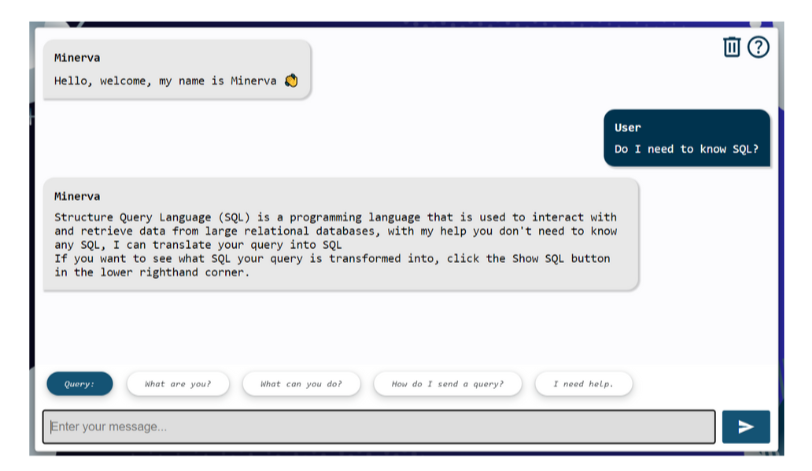

# DCU CA400 - Final Year Project

>Gareth Hogan 20379616  & Jack Farrell 20352136

---

## Table of contents

1. About Minerva
2. Use Case Scenarios
    - Nurse with Patient Records
    - Financial analyst
3. Using Minerva
    - Information and Tips
    - Changing Database
    - Conversing with Minerva
    - Database Queries
    - Advanced Options
4. Further Examples

---

## About Minerva

Welcome to Minerva.

Minerva is a new solution developed to help demystify the complex formatting of SQL and relational database access, Minerva is a conversational chatbot that is trained to help you access and gain value from large stores of data without any prior knowledge of the technology or queries that are normally used to retrieve data.

Through conversation with Minerva, you will be able to learn about, access and even analyse data from a loaded database, all without the burden of creating complex queries. Minerva uses natural language and translation technology to turn your questions into functional SQL queries that can retrieve the data you describe from our loaded database.

This document will present a walkthrough of the different use cases Minerva is aimed at being deployed into, it will also walk you through how exactly Minerva is used and give you plenty of examples of the system in use.

### Use Case Scenarios

Below you can see two examples of use cases that Minerva was designed to help in, the scenario of the nurse and the financial analyst.

**Nurse with Patient Records**
The potential value found in the records of medical patients is huge, and the databases containing thousands of patients and all their data are massive. Each patient has their basic details like age, name, and address recorded, but also all their symptoms, prescriptions, conditions, blood type, etc. The potential for finding analysis is huge and there are many ways to utilise this data.

In this scenario, the best people to analyse and interpret findings are the nurses and doctors trained to recognise symptoms and causes to diagnose what's wrong and administer treatment. However, nurses do not have the time or the technical knowledge to be trawling through millions of data points trying to find what they need. With Minerva a nurse can simply ask Minerva to query the database for what they need and describe it in just a few words, for example, a nurse could ask Minerva to "Show me the patients with Uric Acid levels more than 8 mg/DL".

> This scenario can be explored further by using the Metabolic Syndrome database in the system, this is the default loaded database.

**Financial Analyst**
Financial data is vast, and to the untrained eye, it is just a blur of numbers, share prices, closing prices, and adjusted values. Hidden in these values is a lot of valuable knowledge, patterns and trends to be discovered. But even for an expert who understands the numbers, these data sources coming from stock markets across the globe pump out so much data it can be impossible to view everything.

In this scenario Minerva can help to speed up the retrieval and analysis of data by analysts and stock market employees, making their lives much easier. Analysts can focus on finding the trends and patterns in the data instead of spending time learning and applying SQL queries or trawling through subsections of data manually. Minerva can easily divide data into sections and return only the rows that interest an analyst, for example "Which indexes had a closing price in USD of over 5000?"

> This scenario can be explored further by using the Financial database in the system, which is the alternate database and can be switched to.

### Using Minerva

This section will walk you through the web interface of Minerva, what it looks like, what everything does and how it works. Below you can see the main page that will open when you load up Minerva.

Once loaded you can see the features of Minerva, it is all based on this screen so no need to navigate different pages and menus. In the very centre of the page is the main chatbox where you can converse with Minerva by entering your messages at the bottom.

**Information and tips**
Before you get started it is a good idea to look at the helpful information accessed by the help icon at the top right. This will explain the very basics of what Minerva does, and how to submit a query to the database or a question for Minerva.

The demo version is outfitted with two different databases for you to explore, you can view information on what each database contains by pressing the buttons on the left of the screen.

**Changing the database**
To change between the two databases available you can simply open the change database menu with the button on the left and select the database to be loaded, the website colour scheme will switch indicating which database you have loaded, the current database is also displayed on the left of the chat.

**Conversing with Minerva**
You can also get help and ask Minerva questions about how the system works and what she can do instead of reading the different info menus. Some common and helpful questions would include:

- What can you do?
- How do I send a query?
- What do all the buttons do?
- What datasets are available?

You can also click the quick suggestions above the text input box to quickly ask a simple question.
For example, below you can see Minerva describing what datasets are available and then what exactly is in the medical database.

**Database Queries**
To submit a query to the loaded database you just have to indicate it using the query keyword at the start of your message. For example, you can see two examples being submitted to the two databases.

- Query: How many patients are above 50 and male?
- Query: What is the highest volume of shares traded?

**Advanced Options**
For this demo version, there are also some advanced options to explore using the buttons in the bottom right of the screen.

- The Show SQL button allows you to toggle whether Minerva displays the SQL that was created for your database queries

- If you are struggling to think of prompts to test Minerva with you can open our example document with the example prompts button
- If you want to learn more about Minerva and the code behind her you can open our Gitlab Repo with the source code link

### Further Examples

In this section, you can view and explore some additional examples which showcase different prompts and queries sent into Minerva.

